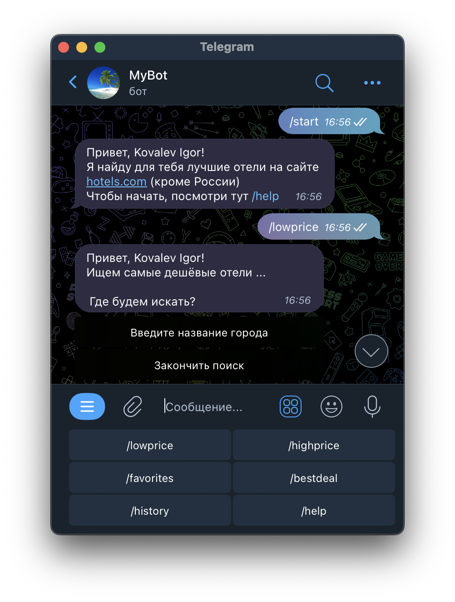

# Too Easy Travel Bot

Too Easy Travel Bot - телеграм бот, с помощью которого можно найти лучшие отели по всему миру.
Бот разработан с помощью библиотеки Telebot и API hotels.com

## Основной функционал и команды

Основная функция бота поиск отелей по запросу пользователя, однако в боте также представлен дополнительный функционал:
1. /lowprice - Показывает топ самых дешевых отелей по выбранному направлению
2. /highprice - Показывает топ самых дорогих отелей по выбранному направлению
3. /bestdeal - Показывает топ предложений по запросу пользователя (близость к центру, цена)
4. /history - Выдаёт историю поиска для пользователя
5. /favorites - Выдаёт избранные отели
6. /help - Выводит справку по командам бота

Также используется эхо (заготовленная реакция).





## Инструкция по установке

1. Клонируйте репозиторий.
2. Создайте и активируйте виртуальное окружение.
3. Установите зависимости из requirements.txt (pip install -r .\requirements.txt)
4. Создайте файл .env; укажите в нём токен вашего бота и API hotels.com (см. образец в env.template)
5. Запустите файл main.py


## Запуск
Находясь в папке проекта, запустите файл main.py
```
python main.py
```


## Зависимости

- charset-normalizer (3.1.0)
- idna (3.4)
- pyTelegramBotAPI (4.10.0)
- python-dotenv (1.0.0)
- telebot (0.0.5)
- loguru (0.6.0)
- requests (2.28.2)
- telebot-calendar (1.2)
- urllib3 (1.26.15)
- colorama (0.4.6)
- peewee (3.16.0)
- win32-setctime (1.1.0)

Список зависимостей можно посмотреть в requirements.txt